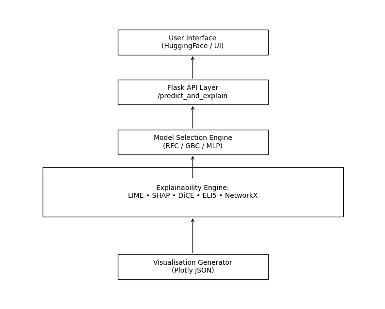

# 🚀 FraudSenseXAI — Advanced Fraud Detection & Explainability Platform

<!-- Project Banner -->
<p align="center">
  
</p>

<!-- Badges -->
<p align="center">
  
  
  
  
  
  
</p>


FraudSenseXAI is a production-ready fraud detection and explainability platform that integrates  
multi-model ML pipelines, multi-method XAI, graph-based interpretability, counterfactual reasoning,  
and real-time visual analytics. It was originally developed as part of an MSc research project and  
has since evolved into a sophisticated, end-to-end AI system suitable for high-stakes financial and  
regulatory environments.

---

## 🔎 Overview

FraudSenseXAI goes far beyond traditional “ML + LIME/SHAP demos.”  
It provides:

- **Real-time fraud prediction**
- **Local, global, and counterfactual explanations**
- **Feature-interaction networks with community detection**
- **Narrative-level interpretability for decision makers**
- **Interactive visual analytics returned as Plotly JSON**
- **A Heroku-deployed inference API with CI/CD automation**

The result is a transparent, auditable, and user-friendly explainable AI system.

---

## ✨ Key Capabilities

### 🔥 1. Multi-Model Fraud Detection Engine
FraudSenseXAI ships with three independently trained pipelines:

| Model | Resampling Strategy | Purpose |
|-------|---------------------|---------|
| Random Forest | ADASYN | High recall on imbalanced data |
| Gradient Boosting | SMOTE | Strong feature interaction capture |
| MLP Neural Network | SMOTETomek | Nonlinear pattern learning |

All pipelines use the same feature-engineering logic at inference time.

---

### 🧠 2. Full-Stack Explainable AI Engine  
The system includes **local, global, and counterfactual explanations**.

#### **Local Explanations**
- LIME (Tabular)
- Kernel SHAP
- ELI5 feature-weight reasoning

#### **Global Explanations**
- Tree SHAP interaction values  
- Top driver features  
- Interaction heatmaps  

#### **Counterfactual Explanations (DiCE)**
- Minimum changes needed to flip a prediction  
- Counterfactual radar charts  
- Side-by-side value comparisons  
- Natural-language “what to change” narratives  

---

### 🕸️ 3. Graph-Based Interpretability  
FraudSenseXAI includes advanced network analysis rarely found in XAI systems:

- Feature-interaction graphs using **NetworkX**
- **Louvain community detection** for clustering
- Interaction strength visualisation (Plotly + Matplotlib)
- Identification of hidden feature relationships

This provides a global, structural view of model behaviour.

---

### 📊 4. Interactive Visual Analytics
The system returns every explanation as **Plotly JSON**, including:

- LIME feature bar charts  
- SHAP value plots  
- SHAP interaction graphs  
- Counterfactual radar charts  
- Counterfactual bar comparisons  
- Clustered feature-interaction networks  

This enables seamless UI integration while keeping the backend fully API-driven.

---

### ⚙️ 5. Production API with Real-Time Explainability

A single endpoint provides the full analysis:

```
POST /predict_and_explain
```

The API returns:

- Prediction outcome  
- Explanation text (LIME or SHAP)  
- Feature-influence summaries  
- Counterfactual recommendations  
- Interaction network structures  
- Plotly visualisation JSON  
- Community detection metadata  

---

### 🚀 6. Deployment & CI/CD Pipeline

- **Heroku** — hosts the Flask API  
- **GitHub Actions** — automates build + deploy  
- **Hugging Face Spaces** — hosts the interactive UI  
- **Gradio** — enables easy end-user experimentation  

This ensures reproducible deployment and streamlined updates.

---

## 🧰 Technology Stack

### **Backend / ML**
- Python  
- Flask (API)  
- scikit-learn  
- SHAP, LIME, DiCE, ELI5  
- NetworkX + Louvain community detection  

### **Frontend / Visualization**
- Plotly  
- Bootstrap  
- Gradio (prototype UI)

### **Infrastructure**
- Heroku  
- GitHub Actions CI/CD  
- Hugging Face Spaces  

---

## 🧩 Architecture Diagram

<p align="center">
  
</p>


## 🏗️ System Architecture

```text
                          ┌───────────────────────────────┐
                          │         User Interface         │
                          │   (HuggingFace / Gradio / UI) │
                          └──────────────┬────────────────┘
                                         │ JSON Request
                                         ▼
                          ┌───────────────────────────────┐
                          │        Flask API Layer         │
                          │         /predict_and_explain   │
                          └──────────────┬────────────────┘
                                         │
                                         ▼
                         ┌──────────────────────────────────┐
                         │       Model Selection Engine      │
                         │  RFC / GBC / MLP Pipelines        │
                         └──────────────┬────────────────────┘
                                         │
                                         ▼
                 ┌────────────────────────────────────────────────────┐
                 │              Explainability Engine                 │
                 │────────────────────────────────────────────────────│
                 │  • LIME (local)                                    │
                 │  • SHAP (local + global + interactions)            │
                 │  • DiCE (counterfactuals)                          │
                 │  • ELI5 (rule-based)                               │
                 │  • NetworkX (interaction graph + Louvain)          │
                 └──────────────┬─────────────────────────────────────┘
                                 │
                                 ▼
                     ┌─────────────────────────────────┐
                     │    Visualisation Generator       │
                     │ (Plotly JSON – UI-ready output) │
                     └─────────────────────────────────┘
```

---

## 🌐 Live Demo

Hugging Face Space:  
👉 https://huggingface.co/spaces/Othniel74/Fraudsense-v1  

Heroku API (private/limited access):  
*(URL if applicable)*

---

## ⭐ Repo Badges (Optional)


---

## 📄 Citation (Optional)

If you use FraudSenseXAI in your research, please cite:

```
Obasi, O. (2024). FraudSenseXAI: A Multi-Method Explainability Platform for Fraud Detection.
```

## 🔌 API Documentation

### Base URL
- **Heroku (API):** *(add your URL here)*
- **Hugging Face demo:** https://huggingface.co/spaces/Othniel74/Fraudsense-v1

### Endpoints

#### `GET /`
Returns a simple landing page describing the project.

#### `POST /predict_and_explain`
Runs inference and returns explainability artefacts + Plotly JSON visualisations.

##### Request body (JSON)
```json
{
  "selected_model": "Random Forest",
  "selected_interpretability_method": "LIME",
  "step": 181,
  "transaction_type": "Transfer",
  "amount": 2500,
  "oldbalanceOrg": 5000
}
```

##### Example `curl`
```bash
curl -X POST "https://<YOUR-HEROKU-APP>.herokuapp.com/predict_and_explain"   -H "Content-Type: application/json"   -d '{
    "selected_model":"Random Forest",
    "selected_interpretability_method":"LIME",
    "step":181,
    "transaction_type":"Transfer",
    "amount":2500,
    "oldbalanceOrg":5000
  }'
```

##### Example Python client
```python
import requests

url = "https://<YOUR-HEROKU-APP>.herokuapp.com/predict_and_explain"
payload = {
    "selected_model": "Random Forest",
    "selected_interpretability_method": "LIME",
    "step": 181,
    "transaction_type": "Transfer",
    "amount": 2500,
    "oldbalanceOrg": 5000
}

resp = requests.post(url, json=payload, timeout=60)
resp.raise_for_status()
data = resp.json()

print("Prediction:", data["prediction_text"])
print("Explanation:", data["model_explanation"][:300], "...")
```

##### Example JavaScript (fetch)
```js
const url = "https://<YOUR-HEROKU-APP>.herokuapp.com/predict_and_explain";

const payload = {
  selected_model: "Random Forest",
  selected_interpretability_method: "LIME",
  step: 181,
  transaction_type: "Transfer",
  amount: 2500,
  oldbalanceOrg: 5000
};

const resp = await fetch(url, {
  method: "POST",
  headers: { "Content-Type": "application/json" },
  body: JSON.stringify(payload)
});

if (!resp.ok) throw new Error(await resp.text());
const data = await resp.json();

console.log("Prediction:", data.prediction_text);
console.log("Explanation:", data.model_explanation);
```

##### Response fields (high-level)
- `prediction_text`: human-readable outcome
- `model_explanation`: explanation narrative (LIME/SHAP)
- `mod_plot`: Plotly JSON for local explanation plot
- `features_influence`: per-feature influence summary
- `network_graph`: Plotly JSON for interaction network
- `top_main_effect`, `top_interaction`: key drivers + interaction pairs
- `radial_plot`, `bar_chart`: Plotly JSON counterfactual visualisations
- `narrative`: counterfactual narrative guidance
```
